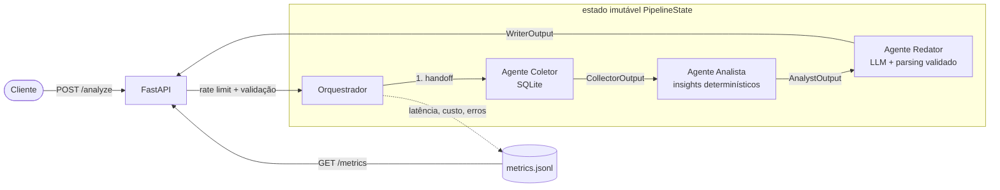

# Agent Observability Hub

   

Sistema multi-agente em Python que analisa custos de frota de caminhões e demonstra práticas de **engenharia de agentes de IA em produção**: output estruturado, guardrails, observabilidade e avaliação sistemática — tudo testável sem gastar um centavo de API.

Três agentes especializados colaboram numa pipeline com orquestração explícita: o **Coletor** consulta os dados da frota (SQLite), o **Analista** calcula insights (custo por km, picos de manutenção) e o **Redator** gera um relatório em linguagem natural via LLM.

## Arquitetura



Cada handoff produz uma **nova cópia** do `PipelineState` (Pydantic `frozen=True`) — sem mutação, com progresso parcial preservado quando um estágio falha. Não é um loop de tool calling: a orquestração é explícita em `app/orchestrator.py`.

## Por que isso importa

Este projeto demonstra, em escala pequena e legível, os quatro pilares de agentes de IA prontos para produção:

- **Output estruturado** — cada agente tem contrato de entrada/saída em Pydantic (`app/schemas/models.py`). O output do LLM é parseado e validado (`app/guardrails/llm_parser.py`); JSON malformado gera retry e depois erro tipado, nunca dado corrompido rio abaixo.
- **Guardrails** — rate limiting por cliente (sliding window), validação de conteúdo antes de cada chamada ao LLM (bloqueia padrões de prompt injection) e tratamento explícito de erros de parsing.
- **Observabilidade** — todo estágio roda dentro de um wrapper que loga latência, custo estimado e sucesso/falha em JSONL local (`app/observability/tracker.py`), agregado por agente em `GET /metrics`. Sem infra externa.
- **Avaliação sistemática** — um mini eval harness (`evals/harness.py`) com 9 cenários determinísticos valida coerência fim-a-fim: o pior caminhão é identificado corretamente? A matemática de custo/km bate? O relatório menciona o veículo certo? Rode a qualquer momento com `python -m evals.harness`.

## Instalação e execução

```bash
git clone https://github.com/<seu-usuario>/agent-observability-hub.git
cd agent-observability-hub
python -m venv .venv
.venv\Scripts\activate        # Windows  |  source .venv/bin/activate (Linux/macOS)
pip install -r requirements.txt
cp .env.example .env           # opcional — sem chave de API, o stub determinístico é usado

uvicorn app.api.main:app --reload
```

Endpoints:

| Método | Rota | Descrição |
|--------|------|-----------|
| POST | `/analyze` | Executa a pipeline (`{"period_days": 90}`) |
| GET | `/metrics` | Métricas agregadas por agente |
| GET | `/health` | Health check |

```bash
curl -X POST http://127.0.0.1:8000/analyze -H "Content-Type: application/json" -d "{\"period_days\": 90}"
```

> **Sem custo de API:** por padrão o Redator usa um `StubLLMClient` determinístico. Para plugar um LLM real, implemente o protocolo `LLMClient` (`complete(prompt) -> str`) em `app/agents/llm_client.py` e injete no `WriterAgent`.

## Testes e cobertura

Desenvolvido com TDD (RED → GREEN → REFACTOR, ver histórico de commits). Toda chamada de LLM é mockada nos testes.

```bash
pytest                          # 69 testes: unitários + integração
pytest --cov --cov-report=term  # relatório de cobertura (94%)
python -m evals.harness         # eval harness: 9 cenários
```

## Exemplo de output

Relatório gerado pela pipeline (`POST /analyze`, dados de exemplo):

```
Relatorio de custos da frota.
Custo total da frota no periodo: R$ 87,800.00.
O veiculo com maior custo por km e RTX3C33 (R$ 0.11/km).
Ranking de custo por km: RTX3C33: R$ 0.11/km; RTX1A11: R$ 0.08/km;
RTX2B22: R$ 0.07/km; RTX5E55: R$ 0.05/km; RTX4D44: R$ 0.05/km.
Alertas: Caminhao RTX3C33 com pico de manutencao: 3 servicos no periodo.
```

Métricas correspondentes (`GET /metrics`):

```json
{
  "collector": {"calls": 1, "error_rate": 0.0, "avg_latency_ms": 0.16, "total_cost_usd": 0.0},
  "analyst":   {"calls": 1, "error_rate": 0.0, "avg_latency_ms": 0.05, "total_cost_usd": 0.0},
  "writer":    {"calls": 1, "error_rate": 0.0, "avg_latency_ms": 0.09, "total_cost_usd": 0.0017}
}
```

Eval harness:

```
[PASS] pipeline_completes
[PASS] worst_truck_identified
[PASS] cost_per_km_math
[PASS] fleet_total_90_days
[PASS] period_filter_widens_total
[PASS] maintenance_spike_alert
[PASS] report_mentions_worst_truck
[PASS] report_is_substantial
[PASS] all_agents_healthy_in_metrics

9/9 eval cases passed
```

## Estrutura

```
app/
├── agents/          # Coletor, Analista, Redator + protocolo LLMClient
├── schemas/         # contratos Pydantic de entrada/saída
├── guardrails/      # rate limiter, validador de conteúdo, parser de LLM
├── observability/   # tracker de latência/custo/erro (JSONL)
├── data/            # seed SQLite com dados de exemplo da frota
├── api/             # camada FastAPI
└── orchestrator.py  # handoffs explícitos com estado imutável
evals/               # mini eval harness (9 cenários)
tests/               # 69 testes (pytest, LLM sempre mockado)
```

## Limitações conhecidas e próximos passos

- **Rate limiter em memória** — por processo; com múltiplos workers, trocar por Redis.
- **Conexão SQLite compartilhada** — adequada para demo; sob concorrência real, usar pool ou um banco cliente-servidor.
- **Custo estimado por heurística** (chars/4 ≈ tokens, preços de referência) — trocar pelos contadores reais de tokens da API do provedor.
- **Sem autenticação** — a API é aberta; produção exige auth (API key/JWT) antes do rate limit.
- **Eval harness determinístico** — valida coerência da pipeline, não qualidade de texto do LLM real; próximo passo natural é um LLM-as-judge para o Redator.
- **Detecção de injection por blocklist** — simples e auditável, mas incompleta; um classificador dedicado seria mais robusto.
- CI real (GitHub Actions) para transformar o badge de build em verdade executável.
